# Blockchain-Based College Admission Transparency System  
Polygon PoS • Smart Contracts • IPFS • Full-Stack dApp

## 📌 Overview
This project implements a decentralized and tamper-proof college admission & waitlist management system using **Polygon Proof-of-Stake**, **Solidity smart contracts**, and **IPFS**.  
The system eliminates manual manipulation, improves transparency, and provides real-time status tracking for students while ensuring verifiable, immutable records for administrators.

---

## 🎯 Key Highlights
- Developed a full-stack blockchain application integrating smart contracts, decentralized storage, and a modern web frontend.  
- Designed an end-to-end transparent admission workflow deployed on **Polygon PoS (Amoy Testnet)**.  
- Leveraged **IPFS (Pinata)** for secure document storage while keeping blockchain storage efficient.  
- Integrated **MetaMask** for secure authentication and transaction signing.  
- Achieved low-cost, high-speed execution using Polygon’s PoS + BFT consensus.

---

## 🔧 Tech Stack
**Blockchain:** Polygon PoS (Amoy Testnet)  
**Smart Contracts:** Solidity, Hardhat  
**Frontend:** React.js, Ethers.js  
**Wallet:** MetaMask  
**Storage:** IPFS (Pinata)  
**Backend Scripts:** Node.js  

---

## 💡 Features
- Students can submit applications, upload documents, and view real-time waitlist status.  
- Administrators can register colleges, verify applicants, and update admission status.  
- Smart contracts enforce:
  - Immutable, tamper-proof storage  
  - Automated input validation  
  - Transparent event logs  
- IPFS ensures document integrity while reducing blockchain storage costs.

---

## 📈 Impact & Outcomes
- Eliminates reliance on centralized admission databases.  
- Creates a **publicly verifiable and trustless** admission workflow.  
- Automates key processes, reducing administrative effort.  
- Ensures data integrity, transparency, and accessibility for all stakeholders.

---

## 🚀 Skills Demonstrated
- Smart Contract Development (Solidity)  
- Decentralized Application Architecture  
- Blockchain–Frontend Integration (Ethers.js)  
- IPFS Document Handling  
- Web3 Authentication (MetaMask)  
- Hardhat deployment & testing  
- Designing secure hybrid on-chain/off-chain systems  

---

## 📂 Repository Structure
- /contracts
- Admission.sol
- /frontend
- react-based UI
- /scripts
- hardhat deployment scripts
- /README.md

---

## 👥 Contributors
**Shakthi Kumaran Gnanavel — 23BCE1686**  
**Pushkar — 23BCE1634**  
**Kriti Sahana V — 23BCE1868**

---

## Screenshots

## Screenshots

### Dashboard
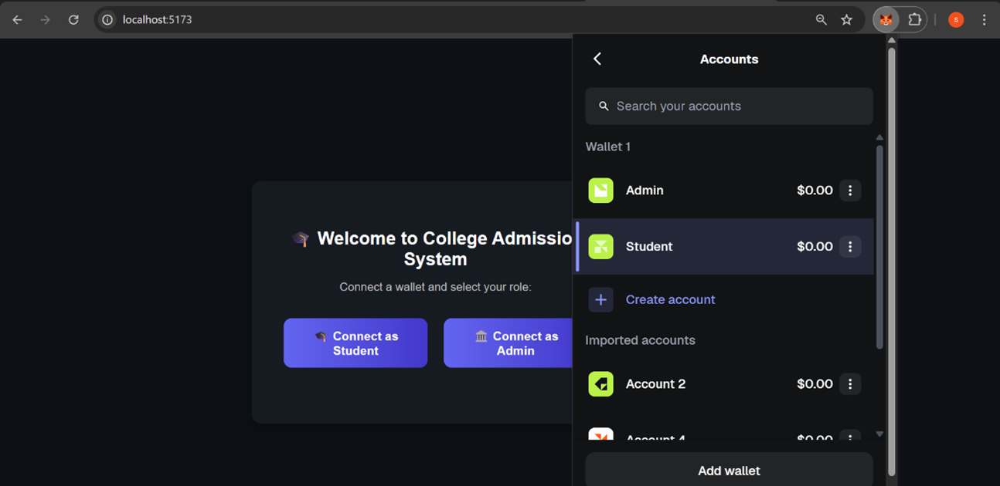

### Connect Wallet
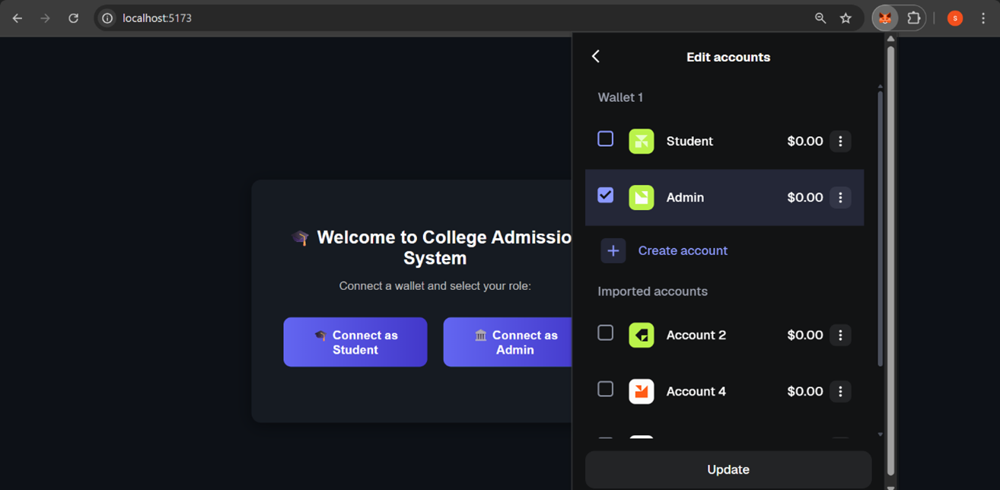

### Connected As Admin
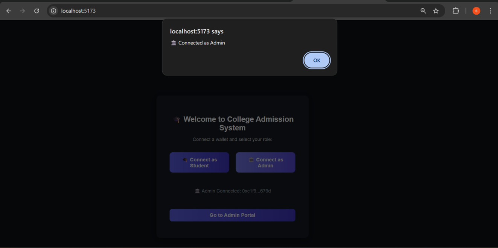

### Admin Dashboard
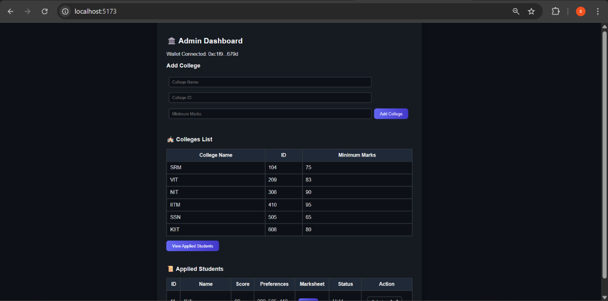

### Add College and Signing
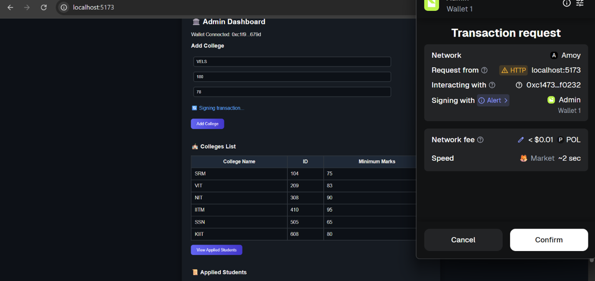

### Transaction Confirmation (Admin)
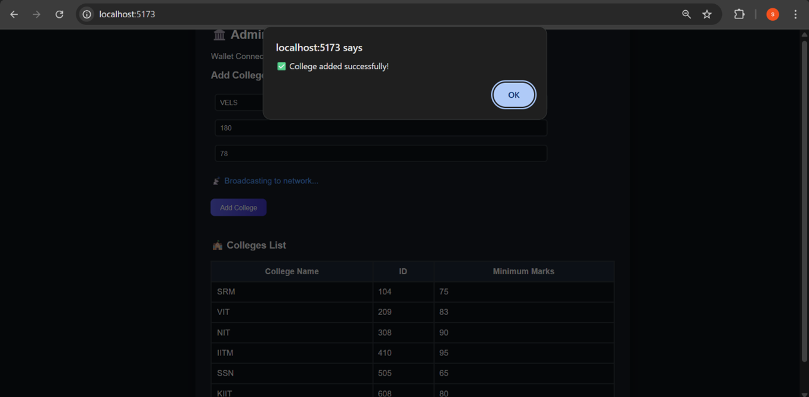

### Broadcasting Transaction
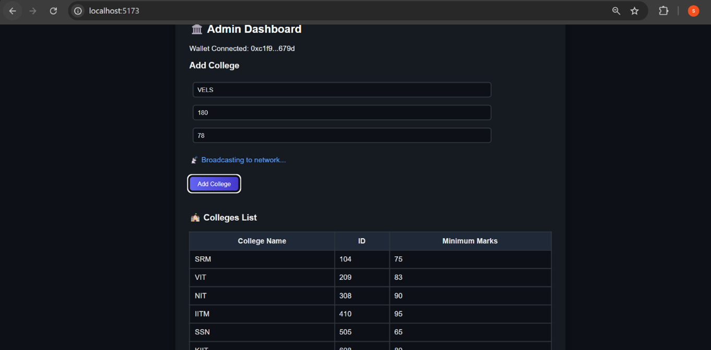

### Block Visualization
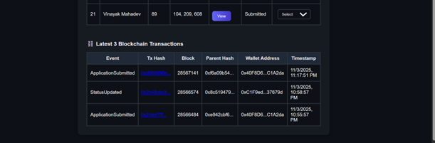

### Polygon View
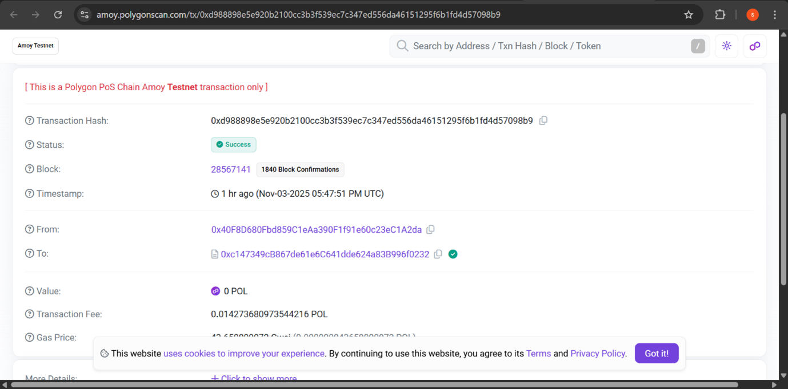

### Student Dashboard
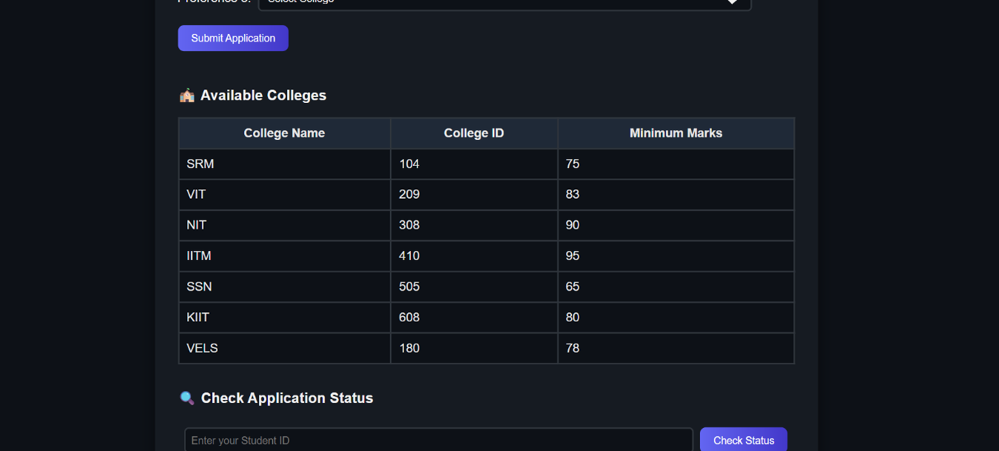

### Student Apply
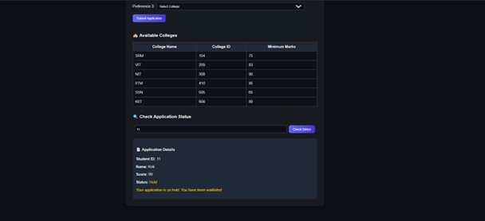

### Student Transaction
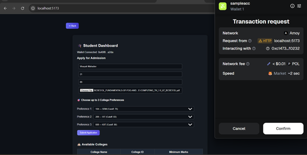

### Smart Contract Creation
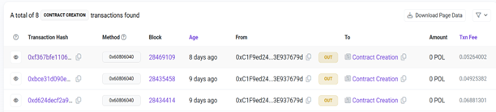

